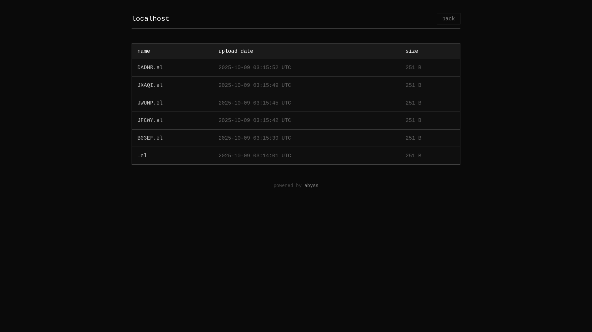

# abyss

abyss is a basic and _mostly_ single user pastebin server written in go made for uploading files (logs, images) and then sharing them to the internet

<figure>
 
 <figcaption>this is abyss' default home page<figcaption/>
</figure>

---

<figure>

  <figcaption>this is abyss' default file presentation<figcaption/>
</figure>

---

<figure>
  
  <figcaption>this is abyss' default directory list<figcaption/>
</figure>

## table of contents

- [features](#features)
- [running abyss](#running)
  - [installing with docker](#docker)
  - [installing manually](#directly)
- [uploading files](#uploading)
- [theming](#theming)
- [docs](#docs)
- [todo list](#todo)

## features

- **file uploads**: supports uploading various file types, including images, videos, and documents.
- **flexible media display**: automatically renders uploaded files on a webpage based on their type (images, pdfs, videos, or plain text).
- **easily customizable interface**: allows for easy modification of color schemes and layout to suit specific design needs.
- **syntax highlighting for code**: syntax highlighting available by default for code files, with support for multiple programming languages. (can be tweaked/changed and even removed)
- **security considerations**: as it is single user, it's mostly secure but there are still some edges to sharpen
- **easy and fast setup**: assets files are baked into the binary, so setting it up is as easy as compiling/grabbing a binary from gh actions (compile/docker) and running it!

## running

#### (recommended) setting it up

- clone the repository and cd into it:

  ```bash
  git clone https://github.com/jabuxas/abyss.git --depth 1 && cd abyss
  ```

- then run `./generate_config.sh` to setup the necessary environment variables
- after that, you can use either docker or run it directly

### docker

- to run with docker, you can use the `docker-compose.yml` file available in this repo. to do so, run:

  ```bash
  docker compose up -d # might be docker-compose depending on distro
  ```

- you can optionally use the [docker image](https://github.com/jabuxas/abyss/pkgs/container/abyss) directly and set it up how you want

### directly

- to run it manually, build it with `go build -o abyss` or grab a binary from github actions and run:

  ```bash
  ./abyss
  ```

- you will need to either:
  - create a `.env` file in `$(pwd)` and set up the necessary variables as in [docs](#docs)
  - run it with the variables prepended: `AUTH_USERNAME=admin AUTH_PASSWORD=admin ./abyss` (example)
- and then (hopefully) create a service that does that automatically and runs `abyss`

## uploading

#### with curl

- you can upload both with the main key and with jwt tokens

##### main key

- to upload your files with main key:

  ```bash
  curl -F "file=@/path/to/file" -H "X-Auth: "$(cat /path/to/.key) http://localhost:3235/
  ```

- it is also possible to add a `-Fsecret=` to your POST to make filenames bigger and harder to guess.

- you should probably create an `alias` or a `function` to do this automatically for you.
  <details>
  <summary>click for an example for bash/zsh:</summary>

  ```bash
  pst() {
    local file

    if [[ -p /dev/stdin ]]; then
      file=$(mktemp)
      cat > "$file"
    elif [[ -n $1 ]]; then
      file="$1"
    else
      echo "Usage: pst [file]"
      return 1
    fi

    curl -F "file=@$file" -H "X-Auth: $(cat ~/.key)" http://localhost:3235/

    if [[ -p /dev/stdin ]]; then
      rm "$file"
    fi
  }
  ```

  </details>

  <details>
  <summary>click for an example for fish shell:</summary>

  ```bash
  function pst
      set -l file

      if command test -p /dev/stdin
          set file "/tmp/tmp.txt"
          cat > $file
      else if test -n "$argv[1]"
          set file "$argv[1]"
      end

      curl -F "file=@$file" -H "X-Auth: $(cat ~/.key)" http://localhost:3235/

      if command test -p /dev/stdin
          rm "$file"
      end
  end
  ```

  </details>

##### with jwt tokens

- you first need to generate them:

  ```bash
  curl -u admin http://localhost:3235/token # you can also access the url in the browser directly
  ```

- the user will be the value of `$AUTH_USERNAME` and password the value of `$AUTH_PASSWORD`

- then you use the token in place of the main key:

  ```bash
  curl -F"file=@/path/to/file.jpg" -H "X-Auth: your-token" http://localhost:3235/
  ```

#### through the browser

- you can only upload text through the browser, to do so, simply write text in the form in the default webpage and click upload.
- this upload can be restricted to need authentication or not, controlled by an environment variable.

## theming

- there is an example homepage in `static/` you can edit directly, which the server will serve automatically
- if running with docker, it's also possible to override `/static` inside the container with your own page.
  - otherwise you will need to clone this repository and edit `static/` and `templates/` manually, or recreate the structure.
- same thing with templates in `templates/`
  - it is preferred to use `dev/` for that reason, since it is git-ignored and that way makes it easier if wanting to update regularly without making changes to the tree
  - you can change the colorscheme by changing the xml at `templates/colorscheme.xml`

## docs

- `ABYSS_URL`: this is used for the correct formatting of the response of `curl`.
- `AUTH_USERNAME | AUTH_PASSWORD`: this is used to access `/tree`, which shows all uploaded files
- `UPLOAD_KEY`: this is key checked when uploading files. if the key doesn't match with server's one, then it refuses uploading.
- `ABYSS_FILEDIR`: this points to the directory where abyss will save the uploads to. defaults to `./files`
- `ABYSS_PORT`: this is the port the server will run on. safe to leave empty. defaults to 3235
- `SHOULD_AUTH`: if it is `yes`, then to upload text you will need authentication (same auth as `/tree`), any value other than that and upload is authless

## todo:

- [x] add upload of logs funcionality (like 0x0.st)
- [x] add docker easy setup
- [x] add file browser (like file://)
- [x] add file extension in its name
- [x] login prompt when accessing /tree
- [x] home page
- [x] custom file displaying!!
- [x] syntax highlighting
- [ ] paste file expiration time
- [ ] password protection for viewing a pasted file
- [ ] button to delete a paste in /tree
- [ ] custom url for an upload
